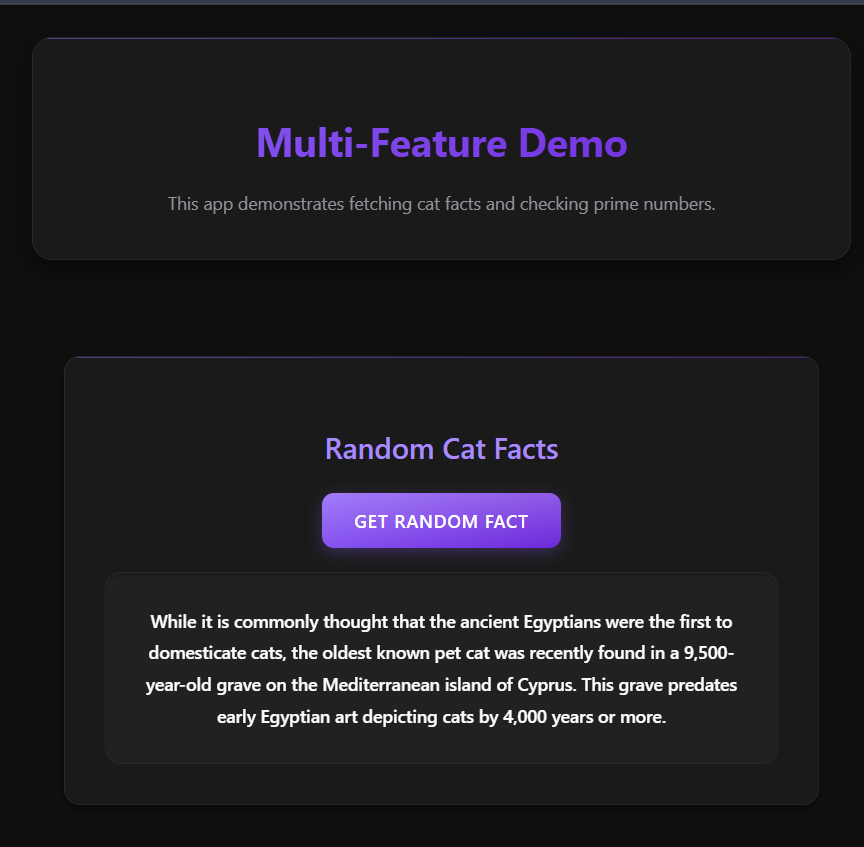

# Full-Stack Demo Application

This is a modern full-stack application that demonstrates the integration of various technologies and features. The application includes two main features: a Random Cat Facts generator and a Prime Number Checker.

## 🚀 Features

### 1. Random Cat Facts
- Fetches random cat facts from an external API
- Beautiful UI with loading states
- Error handling

### 2. Prime Number Checker
- Serverless API endpoint for checking prime numbers
- Real-time validation
- Responsive design

## 📸 Screenshots

### Application Preview



## 🛠 Technologies Used

### Frontend
- React 18
- TypeScript
- Vite
- CSS3 with modern features

### Backend
- Node.js
- Express.js (Development)
- Vercel Serverless Functions (Production)

### Deployment
- Vercel for both frontend and serverless functions
- GitHub for version control

## 🏗 Project Structure

```
├── api/                  # Serverless API functions
│   └── check-prime.js   # Prime number checker endpoint
├── src/                 # Frontend source code
│   ├── assets/         # Images and static assets
│   ├── App.tsx         # Main application component
│   └── main.tsx        # Application entry point
├── public/             # Public assets
├── vercel.json         # Vercel deployment configuration
└── package.json        # Project dependencies and scripts
```

## 🚀 Getting Started

### Prerequisites
- Node.js (v14 or higher)
- npm (v6 or higher)

### Installation

1. Clone the repository:
```bash
git clone https://github.com/yourusername/your-repo-name.git
cd your-repo-name
```

2. Install dependencies:
```bash
npm install
```

3. Start the development server:
```bash
npm run dev
```

The application will be available at `http://localhost:5173`

## 🌍 Environment Variables

No environment variables are required for basic development. The application automatically handles API URLs for both development and production environments.

## 📝 API Endpoints

### Prime Number Checker
- **Endpoint:** `/api/check-prime`
- **Method:** POST
- **Body:**
  ```json
  {
    "number": 17
  }
  ```
- **Response:**
  ```json
  {
    "number": 17,
    "isPrime": true
  }
  ```

### Cat Facts
- Uses external API: `https://catfact.ninja/fact`

## 🚀 Deployment

The application is configured for automatic deployment on Vercel:

1. Connect your GitHub repository to Vercel
2. Vercel will automatically detect the configuration
3. Both frontend and API will be deployed automatically

## 💻 Development

### Available Scripts

- `npm run dev` - Start development server
- `npm run build` - Build for production
- `npm run preview` - Preview production build locally

### Code Structure

- React components are written in TypeScript
- CSS modules for styling
- Serverless functions in the `api` directory

## ✨ Features in Detail

### Cat Facts Component
- Fetches random facts about cats
- Displays loading state during API calls
- Handles errors gracefully

### Prime Number Checker
- Client-side input validation
- Server-side number validation
- Real-time response handling
- Loading states for better UX

## 🤝 Contributing

Contributions are welcome! Please feel free to submit a Pull Request.

## 📄 License

This project is licensed under the MIT License - see the [LICENSE](LICENSE) file for details.

## 👏 Acknowledgments

- [Cat Facts API](https://catfact.ninja) for providing the cat facts
- Vercel for hosting and serverless functions
- React and Vite communities for excellent documentation
